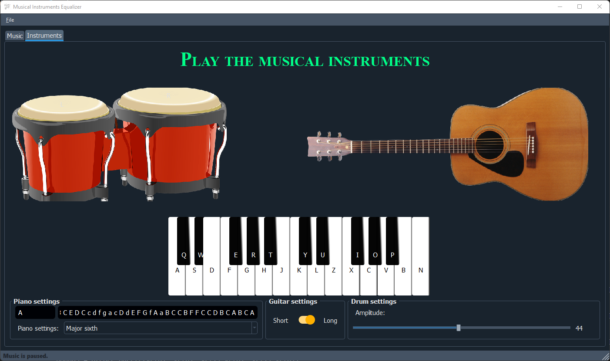
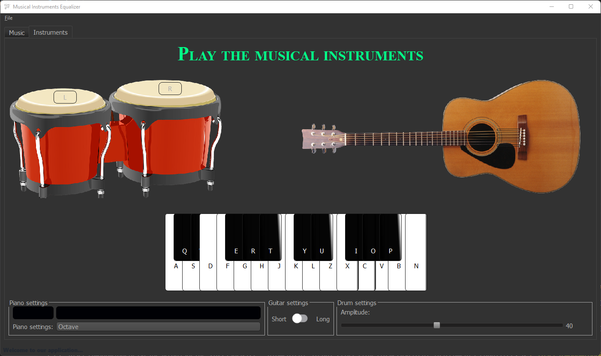

# Musical Instruments Equalizer

**Equalizer application for specific musical instruments (Piano, Guitar, Drum) whit ability to generate sound from it.**

## Description

- The first tab contains a **spectrogram** and a **music player** interface with volume control, pause/unpaused button and indicator to the place the sound come from.

- The bottom area contains the **equalize** sliders for each instrument.

- The seconed tab contains the instruments to **generate** sound and play on it, with some **settings** to control it.

## Dependincies

- **python 3.10**

**Used packege:**

```
functools
threading
numpy
pandas
matplotlib
scipy
PyQt5
pyqtgraph
qtwidgets
qdarkstyle
qtpy
pygame
sounddevice
simpleaudio
soundfile
mutagen
datetime
```

***to install***: `pip install [python-library]`

## Preivew

**Light mode**


**Dark mode**




**Orange mode**




---

***Note: problem in :***

- *Equalizer algorithm*
- *Equalizer sliders design*

***will be fixed.***
